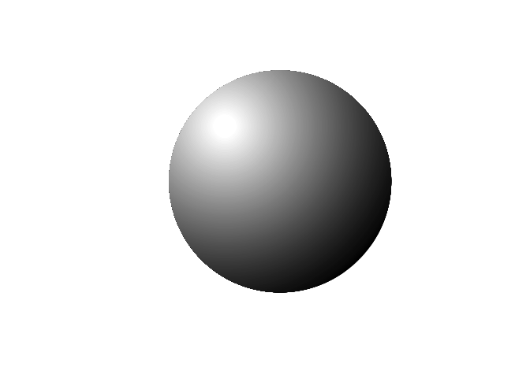
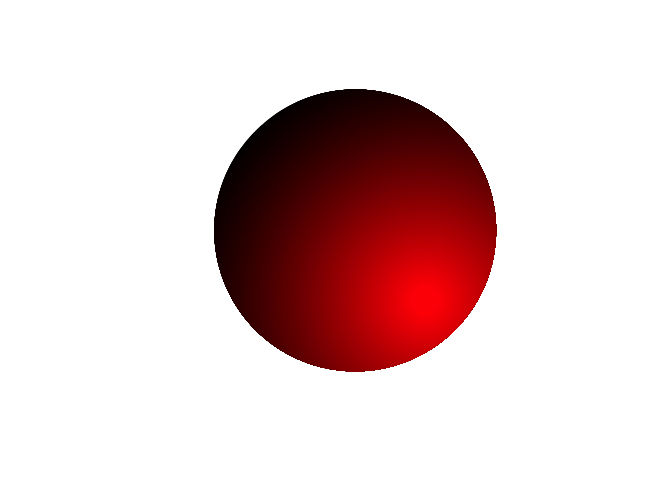

<!-- README.md is generated from README.Rmd. Please edit that file -->

# rsphere

<!-- badges: start -->

[](https://github.com/ahasverus/rsphere/actions)
[](https://opensource.org/licenses/MIT)
[](https://www.tidyverse.org/lifecycle/#experimental)
<!-- badges: end -->

The goal of rsphere is to plot a 2D shaded sphere with a two-colours
gradient.

## Installation

You can install the development version from
[GitHub](https://github.com/ahasverus/rsphere) with:

``` r
# install.packages("remotes")
remotes::install_github("ahasverus/rsphere")
```

## Usage

``` r
plot(x = 0, y = 0, asp = 1, xlim = c(-1, 1), ylim = c(-1, 1), axes = FALSE, ann = FALSE)
rsphere::add_sphere()
```



``` r
plot(x = 0, y = 0, asp = 1, xlim = c(-1, 1), ylim = c(-1, 1), axes = FALSE, ann = FALSE)
rsphere::add_sphere(x1 = 0.5, y1 = -0.5, col = c("black", "red"))
```


